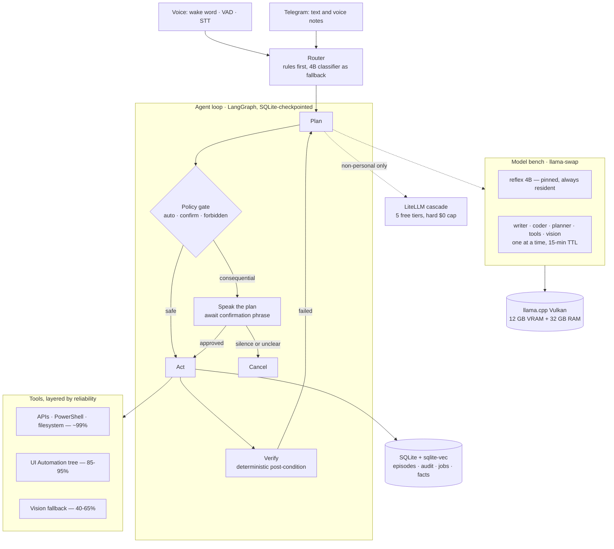

<h1 align="center">VAJREN</h1>

<p align="center">
  <strong>A local-first autonomous assistant that speaks its plan and waits for permission.</strong><br>
  Runs entirely on one mid-range desktop. Costs nothing to operate.
</p>

<p align="center">
  
  
  
  
  
  
</p>

---

## What this is

Vajren is a personal AI assistant that runs on my own hardware: it listens for a
wake word, holds a spoken conversation, states what it intends to do, and executes
only after I say the confirmation phrase out loud. It reads email, drives the
desktop and browser, writes and runs code, drafts in my voice, and produces
designed output — with every consequential action gated, logged, and reversible.

The interesting constraint is not that it works. It is that it works **on a
£300-class gaming GPU, on Windows 10, for zero recurring cost**, and that the
architecture is shaped almost entirely by taking that constraint seriously.

> **This is a build in progress.** The [Status](#status) table below is honest
> about what runs today. The reasoning behind every decision — including the wrong
> turns — is in **[`docs/JOURNAL.md`](docs/JOURNAL.md)**.

---

## The constraint

| | |
|---|---|
| **CPU** | AMD Ryzen 5 7600X — 6c / 12t |
| **RAM** | 32 GB |
| **GPU** | Radeon RX 6750 XT — **12 GB VRAM**, RDNA2, `gfx1031` |
| **OS** | Windows 10 Pro 19045 |
| **Inference** | llama.cpp **Vulkan** — *not* ROCm |
| **Budget** | **$0 / month**, hard |

Two facts about that GPU shape everything downstream:

**AMD dropped this card.** The HIP SDK requires Windows 11 and lists `gfx1031` as
unsupported even there; ROCm on WSL2 dropped RDNA2 as well. The community
workaround — patched rocBLAS pinned to an old Ollama build — requires never
accepting an update, which disqualifies it for something meant to run unattended
for months. **The Vulkan backend needs nothing but the stock driver and measures
~82 tok/s generation on this exact card** — level with an RX 6800 XT running
official ROCm. Every `HSA_OVERRIDE_GFX_VERSION` guide on the internet is safely
ignorable here.

**12 GB holds one 20 GB-class model at a time.** That single fact produced the
model bench, the swap layer, and the routing design below.

---

## Architecture



---

## The model bench

One model does not win everything at this size. Writing a cold email and fixing a
failing test are different skills, and the coding benchmarks say nothing about the
first one. So Vajren runs a bench of specialists, routed per task.

| Lane | Model | On disk | Evidence |
|---|---|---|---|
| **reflex** *(pinned)* | Qwen3-4B-Instruct-2507 | 2.5 GB | Always resident, so routing never pays a swap |
| **writer** | Gemma-4-31B-it | 18.5 GB | Creative Writing v3: **1407.6** |
| **coder** | Qwen3.6-35B-A3B | 22.1 GB | SWE-bench Verified **73.4** · Terminal-Bench 2.0 **51.5** |
| **planner** | *same weights, thinking mode* | — | GPQA-D **86.0** · AIME26 **92.7** |
| **tools** | GLM-4.7-Flash | 17.5 GB | τ²-bench agentic tool use **79.5** |
| **vision** | Qwen3-VL-8B-Instruct | 6 GB | Screenshots, charts, UI grounding |
| **ocr** | RapidOCR *(CPU)* | — | No GPU involved at all |

The number that justifies the whole design: on writing quality, **Llama-3.1-70B
scores 833 while a 24B Mistral scores 1242.** Size does not buy prose.

Six models do not fit in 12 GB, so [`llama-swap`](https://github.com/mostlygeek/llama-swap)
rotates them — a 4B classifier pinned permanently, one specialist warm on a
15-minute TTL, and a prewarm call fired the instant routing decides so the ~26 s
load hides behind the graph's own bookkeeping.

---

## Design principles

**1 · Structure beats pixels.** Every reliable layer reads structured data — a UI
Automation tree, a DOM accessibility tree, an API response, a JSON schema. Every
unreliable layer guesses from an image. Published state of the art for vision-driven
Windows control is ~56%; UI Automation is 85–95%. So APIs first, accessibility tree
second, pixels only when nothing else exists.

**2 · "Without failing" means zero *unrecoverable* failures.** Not zero mistakes —
nothing achieves that, and promising it would make every other decision dishonest.
Every action succeeds, fails safely with an undo path, or fails loudly. Trash, not
delete. Draft, not send. Git commit around every file edit.

**3 · Rules live in code, not in prompts.** A prompt can be argued with by text
hidden inside an email. An `if` statement cannot. The policy gate, the
private/public data split, and the path denylist are all enforced in Python, and
`config/policy.yaml` is never writable by the agent.

**4 · The approval gate is doing double duty.** It was designed as a UX preference —
I want to be asked. It is also the strongest available defence against prompt
injection, because it breaks the chain between reading untrusted content and taking
consequential action. Untrusted text is additionally *quarantined*: extracted into a
rigid schema by a call with no tools, so raw email bodies never reach the planner.

**5 · Verify with code, never with a model.** The most common documented agent
failure is declaring success without checking. Every mutating tool must supply a
deterministic post-condition — the file exists with the expected hash, the message
is in Sent, the event reads back — before it can be registered at all.

---

## Status

| Phase | State |
|---|---|
| 00 · Machine prep | scaffolded |
| 01 · Inference (llama.cpp Vulkan) | scaffolded |
| 01·B · Model bench + routing | designed, untested |
| 02 · Free-tier cascade (LiteLLM) | config written |
| 03 · Voice loop | not started |
| 04 · Agent loop (LangGraph) | skeleton written |
| 05 · Desktop + browser control | not started |
| 05·B · Design toolkit | documented |
| 06 · Memory | schema written |
| 07 · Always-on service + remote | not started |
| 08 · Security | policy written and enforced by design |
| 09 · Reliability + evals | partial |
| 10 · Self-extension | not started |

---

## Quick start

```powershell
git clone https://github.com/MuditNautiyal-21/vajren.git
cd vajren

.\scripts\00-check-hardware.ps1     # GPU, Vulkan, disk type, power settings
.\scripts\01-setup-python.ps1       # conda env + dependencies
.\scripts\02-get-runtime.ps1        # llama.cpp Vulkan, pinned release
.\scripts\03-get-models.ps1         # GGUF weights, ~34 GB for tier 1
.\scripts\90-tune-moe.ps1           # find the right --n-cpu-moe for your VRAM
.\scripts\04-start-stack.ps1        # llama-swap + LiteLLM

python core\main.py                 # the loop, over text, before voice exists
```

Then `cp config/voice.example.md config/voice.md` and paste in real messages you
have written — the writer lane learns tone from that file, and it moves output
further than any model swap does.

---

## Repository layout

```
config/     policy tiers · task router · llama-swap bench · LiteLLM cascade
core/       agent loop · policy gate · router · style guard · verification
voice/      wake word · STT · TTS · barge-in · approval dialogue
memory/     SQLite schema: episodes, append-only audit, jobs, facts, chunks
skills/     git-versioned SKILL.md library, one folder per skill
scripts/    setup, model downloads, MoE tuning, stack start
docs/       JOURNAL.md — the build record · DESIGN-TOOLKIT.md
tests/      promptfoo regression suite, including prompt-injection cases
```

---

## The journal

Every junction in this project is logged in **[`docs/JOURNAL.md`](docs/JOURNAL.md)** —
what the problem was, what was considered, what was chosen, why, what it cost, and
what it actually bought. Including the decisions that turned out wrong and were
reversed, which are the entries worth reading.

A sample of what's in there:

- **J-003** — why Vulkan and not ROCm, and why the community ROCm patch was rejected
- **J-012** — the arithmetic proving GLM-5.2 cannot run here, so nobody re-litigates it
- **J-013** — the original workhorse model was the wrong pick, and why
- **J-016** — six models on a GPU that holds one
- **J-022** — the external SSD turned out to be exFAT, which silently made the
  restricted-account isolation decorative

---

## Honest limits

The best open-weight model that fits this hardware sits at roughly **51% of a
frontier model on raw intelligence and 36% on agentic work** — and the agentic gap
being the wider one is the point of the whole harness.

Where it genuinely falls short:

- **Long-horizon chains.** Ten-plus sequential tool calls with state tracking and
  re-planning. Tasks are designed as short, verified hops instead.
- **Ambiguous multi-tool orchestration.** Usually fine, occasionally *silently
  wrong* — which is the dangerous mode, and the reason for the approval gate.
- **Long context.** A 262K advertised window is a storage ceiling, not a retrieval
  guarantee. Assume 32–64K of genuinely usable retrieval.
- **Pixel-driven desktop control.** ~40–65% per task. Always retried, always gated.
- **Generative video.** Not achievable on this GPU. Frames are assembled with ffmpeg.

---

## License

MIT — see [LICENSE](LICENSE).

<sub>Built by <a href="https://github.com/MuditNautiyal-21">Mudit Nautiyal</a> ·
<a href="https://www.linkedin.com/in/mudit-nautiyal">LinkedIn</a> ·
<a href="https://mudit-nautiyal.vercel.app">Portfolio</a></sub>
