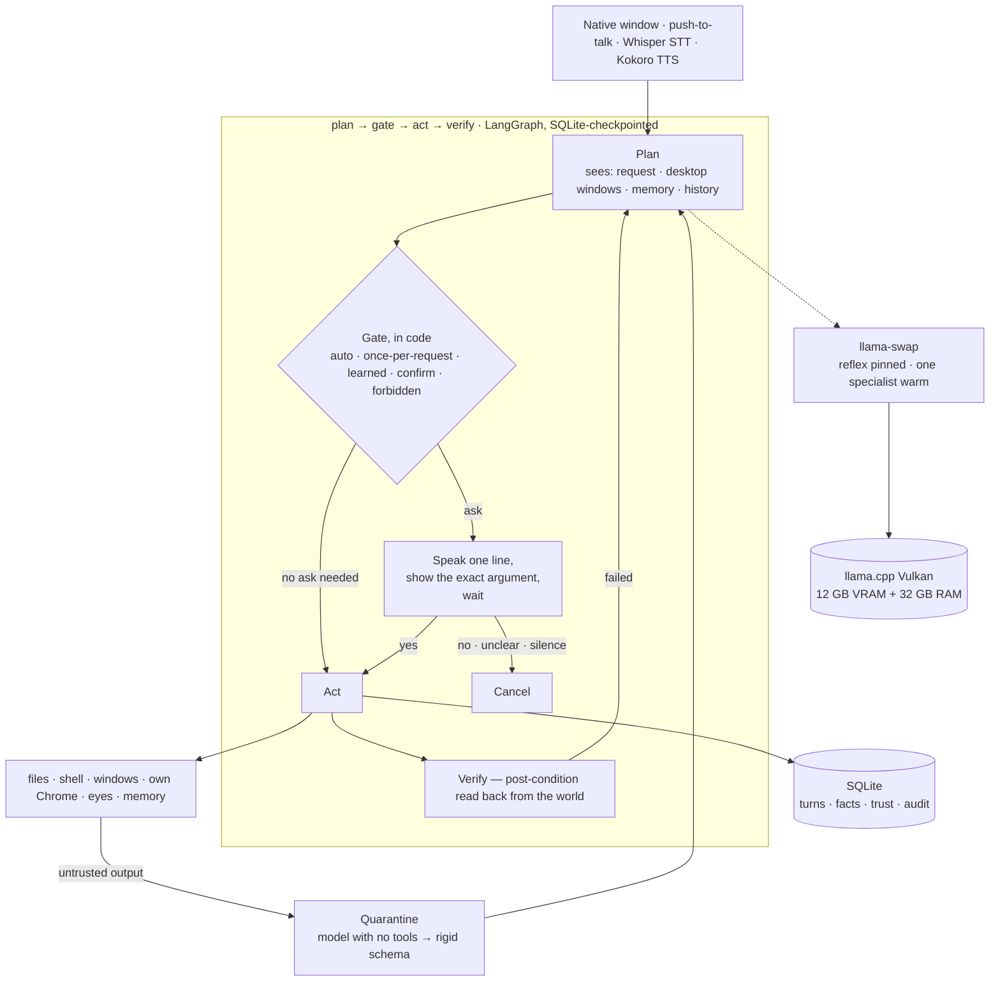

<h1 align="center">VAJREN</h1>

<p align="center">
  <strong>A local-first personal assistant that says what it is about to do, and waits for a yes.</strong><br>
  Voice in, voice out, its own hands on the desktop and the web.<br>
  A fully offline AI agent on one mid-range PC, for $0/month — no API key, no cloud, no subscription.
</p>

<p align="center">
  
  
  
  
  
  
  
</p>

---

## What it does today

Everything below runs on the author's machine and is covered by the test suite.
Nothing here is a plan.

**You talk to it.** A native Windows window with push-to-talk. Speech is transcribed
locally (faster-whisper), answers are spoken locally (Kokoro). Nothing leaves the PC.

**It acts, in steps, and checks its work.** A `plan → gate → act → verify` loop
(LangGraph, checkpointed to SQLite). Every tool has a typed schema, an idempotency key,
an undo path and a post-condition that is read back from the world in code — a file's
hash, a window actually in the foreground, a page's URL — never a model's opinion.
A "done" whose summary is a promise ("I'll open Chrome…") is refused and re-planned.

**It asks first — and learns when not to.** Three tiers, all decided in code:

| tier | what | example |
|---|---|---|
| auto | read-only, reversible | read a file, search, look at the screen |
| once per request | things that only *open* | apps, URLs, pages, clicks, typing |
| learned | a shape approved 3× running stops asking; says so aloud; one cancel resets; "ask me about that again" revokes | opening files in a folder |

Shell commands, deleting, sending, pushing and installing ask every time and can
never earn trust. Buttons labelled buy / pay / send / post / delete / submit always ask.
Password fields are refused outright.

**It understands a person, not a password.** ~25 natural approvals ("sure", "okay",
"do it", "carry on"). Order decides, not presence: *"yes, go ahead, and make sure it
does not stay hidden"* is a yes. Retractions ("cancel", "stop", "never mind") win from
anywhere. A yes with something walked back after it is re-asked, never guessed.
Names spelled letter by letter are assembled in code, not by the model.

**It has hands.** Files, a sandboxed shell, windows (open, focus, close — on the monitor
you are looking at), and its own Chrome profile it can search, click and type in.
It clicks by number *and* label, and re-reads the label off the element before pressing.

**It has eyes.** `look_at_screen` — a screenshot of the monitor the cursor is on,
described by a local vision model. Used when you say "I can't see it" or "what does
this error say". About 20 seconds; the image never leaves the machine.

**It remembers.** One bounded SQLite file. The last turns load at startup so "do that
again" survives a restart; facts you tell it persist and are recalled when relevant;
durable facts are distilled from finished turns in the background. Memory holds what
you said and what it did — never the contents of a file, page or command.

**It builds a picture of what it has met.** Every finished turn feeds an entity graph —
people, apps, files, folders, topics — that links whatever keeps turning up together and
strengthens each link as it recurs. A request lights up the neighbourhood it touches, and
that is what the planner is handed as context. A background consolidation pass merges
duplicates (including the five ways Whisper spells the same name), retires stale lessons
and decays what stopped mattering. Provenance is enforced: what a *page* said is stored
but can never become a belief — only what you said, or what it did itself, may.
`scripts/44-brain.py` prints the graph and can delete anything in it.

**It answers to its own name.** A custom "Vajren" wake word, trained locally by
`scripts/43-train-wake.py` from Kokoro-spoken samples — no downloads, no cloud — running
on the CPU through openWakeWord (99.7% true-positive at threshold 0.5). Say the name once
and it listens; while it is answering you, and for eight seconds after a task finishes, it
keeps listening, so a follow-up needs no name.

**You can call it off mid-task.** Say its name over the top of what it is doing, or press
ESC, and it stops *between* steps and takes the new instruction — never mid-tool, so a
half-written file is not a thing that can happen. A stop is not an undo: anything already
done is reversed the normal way, through the undo path every mutating tool must have.

**It cannot be talked into things by a web page.** Untrusted text — file contents,
page text, command output — is extracted into a rigid schema by a model with no tools
before the planner sees a word of it. Three injection attacks are in the test suite
and must all fail.

---

## The hardware: a 35B model on a 12 GB AMD card, with Vulkan instead of ROCm

| | |
|---|---|
| CPU / RAM | Ryzen 5 7600X · 32 GB |
| GPU | Radeon RX 6750 XT · **12 GB** · RDNA2 |
| OS | Windows 10 |
| Inference | llama.cpp, **Vulkan** backend — not ROCm |

AMD's HIP SDK does not support this card on Windows 10, and the ROCm workarounds pin you
to builds you can never update. The stock Vulkan backend needs nothing but the driver.
Every number below is measured on this exact hardware.

| what | measured |
|---|---|
| 35B MoE workhorse, `--n-cpu-moe 26` | **30.8 tok/s** generate (20 hung the machine; 32 → 20.7) |
| one planning step, thinking off | **3.9 s** (thinking on: 5.1 s, same accuracy) |
| quarantine extraction | **4.3 s** (was 35 s with thinking on) |
| `browser_open` | 3.6 s |
| `look_at_screen` | ~20 s (36 s cold) |
| voice out / in | 0.8 s / 0.9 s, both on CPU while the GPU thinks |
| swap between specialists | 19–36 s — so tasks are batched by lane, never alternated |

## The models, and how four of them share one 12 GB GPU

12 GB holds one 20 GB-class model at a time, so
[`llama-swap`](https://github.com/mostlygeek/llama-swap) rotates specialists behind one
endpoint and [LiteLLM](https://github.com/BerriAI/litellm) fronts it.

| lane | model | role |
|---|---|---|
| reflex | Qwen3-4B-Instruct-2507 | pinned, always resident, CPU — classification, quarantine, memory distillation |
| workhorse | Qwen3.6-35B-A3B (MoE) | planning and everything consequential |
| tools / writer-alt | GLM-4.7-Flash | agentic tool use; prose |
| vision | Qwen3-VL-8B-Instruct | screenshots |

A dedicated writer model is configured but not yet downloaded; the GLM lane covers it.
A cloud cascade of free tiers exists in the LiteLLM config for non-personal work only
and is not used by anything today.

---

## Architecture



---

## Design rules that held up

**Rules live in code, not in prompts.** A prompt can be argued with by text hidden in a
file. An `if` statement cannot. The gate, the tiers, the path denylist, the risky-label
list and learned trust are all Python over `config/policy.yaml`, which the agent can
never write.

**The return value of the thing being checked is never the check.** `SetForegroundWindow`
returns TRUE while only flashing the taskbar. A launcher exits 0 after handing off.
Post-conditions read the world back: `GetForegroundWindow`, the file's hash, the page URL.

**A missing capability must surface as "I can't", not as a confident workaround.**
Three separate bugs came from the planner reaching for the nearest tool it had — a shell
search for a file, a second Notepad for "bring it to front", a second browser for a page
already open. The fixes were tools, perception, and the sentence "I can't".

**Measure before optimising.** Routing planning to the small model was 3× *slower* and
less accurate. Disabling thinking was the win. Every number in this README came from a
script in `scripts/`.

**Silent failure is the dominant risk on this stack.** Nothing errors; things get slow
or quietly wrong. That is why every fix comes with a test, and why
`scripts/31-session-audit.py` scores each spoken session out of 100 from its log.

---

## Install and run it on Windows

Built and tested on Windows 10 with the AMD card above, Python 3.11. `bootstrap.py`
detects other GPUs and operating systems and picks a backend, but only this
configuration has actually been run.

```powershell
git clone https://github.com/MuditNautiyal-21/vajren.git C:\vajren
cd C:\vajren
python bootstrap.py              # detect hardware, set up .venv, fetch runtime + models
.\scripts\20-ui.ps1              # models → gateway → native window
.\scripts\99-test-all.ps1        # 15 suites, ~14 min
```

`bootstrap.py` installs everything inside the folder — Python packages, the llama.cpp
runtime, model weights. It does not touch drivers, PATH, services or ask for elevation.
No API key is needed for anything. See [SECURITY.md](SECURITY.md).

Useful afterwards: `scripts/30-memory-report.py` (what it knows and what it has
stopped asking about), `scripts/44-brain.py` (the entity graph — read it, consolidate it,
or delete something from it), `scripts/31-session-audit.py` (how well the last sessions
went), `scripts/17c-stt-settings.py logs\utterances\*.wav` (replay what it heard).

---

## Repository layout

```
core/        graph.py (the loop) · policy.py (the gate) · memory.py · brain.py (the entity graph) · wake.py
             browser.py · desktop.py · voice.py · server.py · app.py
core/tools/  files · shell · apps (windows) · web (own Chrome) · vision · mem
config/      policy.yaml (tiers, never agent-writable) · llama-swap.yaml · litellm.yaml · voice-names.txt
ui/          the face: one HTML file, WebView2
memory/      schema.sql · vajren.db (bounded; gitignored)
scripts/     numbered: setup → models → tests → reports
```

---

## What it cannot do yet

- Write outside its own `workspace/` and `sandbox/` — widening that is a deliberate,
  per-folder decision.
- Press buttons in native dialogs. It can read them; nothing clicks them yet.
- Scroll a long web page, or use more than one tab.
- Email, calendar, messaging. Not started.
- Be reached remotely. Tailscale plus a Telegram bot is the plan; nothing is wired.
- Run unattended. The always-on service is built (`scripts/41-install-always-on.ps1`)
  and deliberately switched off — it was not good enough to live with yet.
- Act without being asked. An autonomy tier exists in the config and is inert; nothing
  moves into it without a decision, per tool.
- Hear its own name reliably in *dictation* — the wake word is solid, but Whisper still
  needs a spelling hint mid-sentence and even then it is not perfect.

---

## Further reading

- [Security model and threat assumptions](SECURITY.md) — what the gate promises, what it
  does not, and what an attacker would have to do.
- [What is next, and what was deliberately left out](NEXT-STEPS.md).
- [Every model this fetches, and from where](docs/DOWNLOADS.md) — exact filenames and
  sources, so you can see what `bootstrap.py` pulls, or fetch them by hand.
- [Conventions for working in this repo](CLAUDE.md) — the rules any contributor, human or
  otherwise, is held to.

---

## License

MIT — see [LICENSE](LICENSE).

<sub>Built by <a href="https://github.com/MuditNautiyal-21">Mudit Nautiyal</a> ·
<a href="https://www.linkedin.com/in/mudit-nautiyal">LinkedIn</a> ·
<a href="https://mudit-nautiyal.vercel.app">Portfolio</a></sub>
